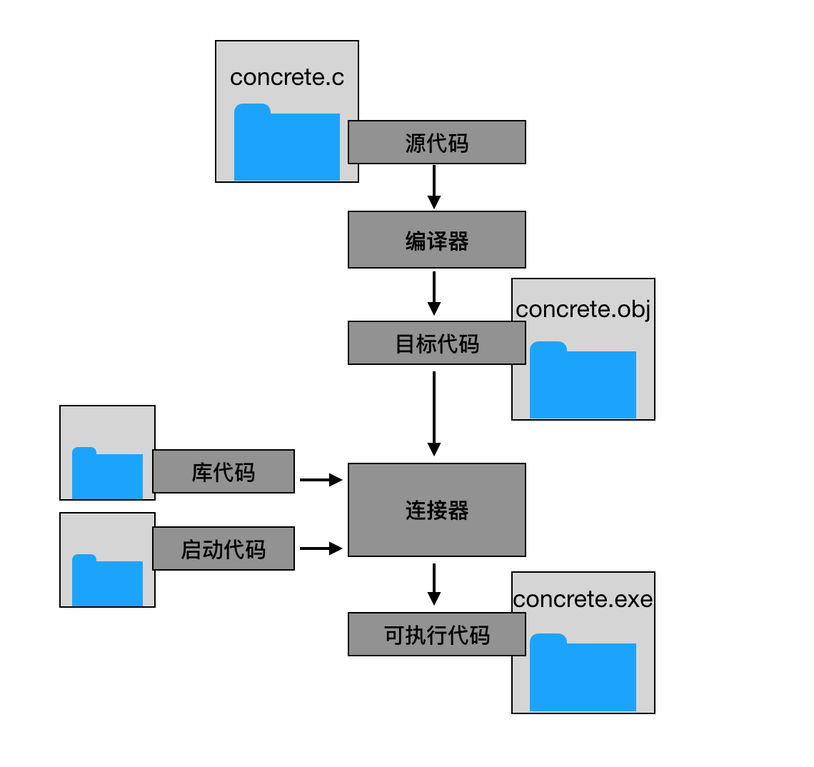

### C 语言的起源
贝尔实验室的 Dennis Ritchie 在 1972 年 开发了 C，C 来自 Thompson 的 B 语言。当时 Ken Thompson 和 Dennis Ritchie 一起设计 UNIX 操作系统。

### C 的优点

- 强大的控制结构
  + 自顶向下的规划、结构化的编程、模块化的设计，程序更可靠、易懂。
- 高效 快速
  + C 是一种编译型的语言，程序会编译成机器语言，运行速度快。对内存具有汇编语言一样的精细控制能力。
- 可移植性好
  + C 是一种系统级编程语言，具有很好标准，不同操作系统平台可移植性较好。
- 紧凑的代码——程序更小

### C 的缺点

- 自由往往带来更多的风险
- 含糊代码

### 编译器

编译器是将高级语言程序解释成计算机所需的详细机器语言指令的程序。
  
### 使用 C 语言的 7 个步骤

1. 第 1 步：定义程序目标
2. 第 2 步：设计程序
3. 第 3 步：编写代码
4. 第 4 步：编译
5. 第 5 步：运行程序
6. 第 6 步：测试和调试程序
7. 第 7 步：维护和修改程序

### 源文件、目标代码文件、可执行文件和库

- 源文件
  + 存放编写的 C 代码的源代码的文件
- 目标代码文件
  + 一般来说，是由编译器将原代码转换为的机器代码
  + 缺少启动代码（start-up）和库代码，不是一个完整的程序，不可运行
- 库
  + 存放许多函数代码，共开发者使用
- 可执行文件
  + 有连接器将目标代码、系统标准启动代码和库函数代码结合在一起的可运行的程序
  
### 编译器和连接器

  
